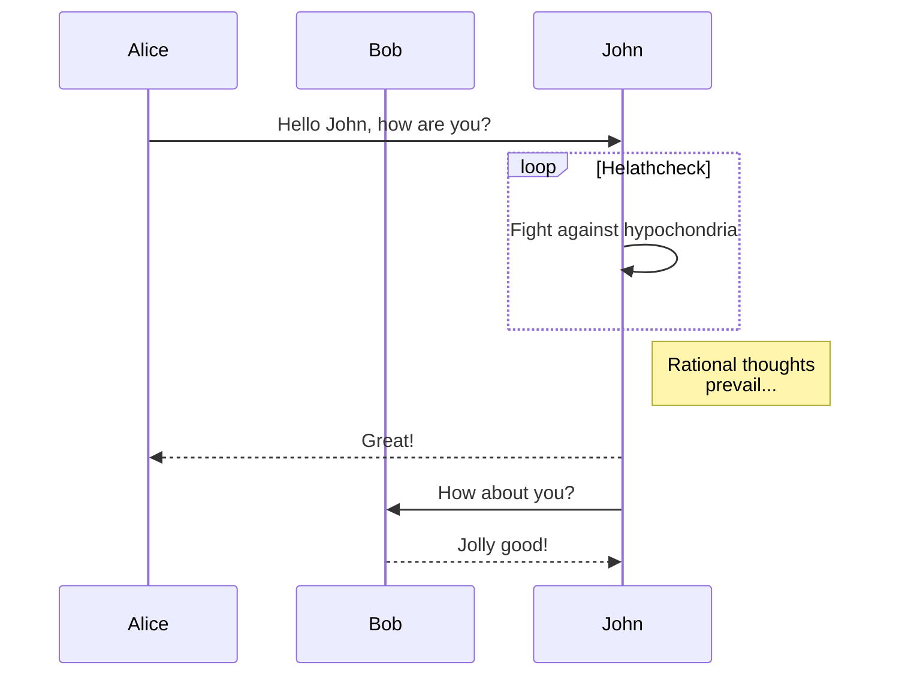
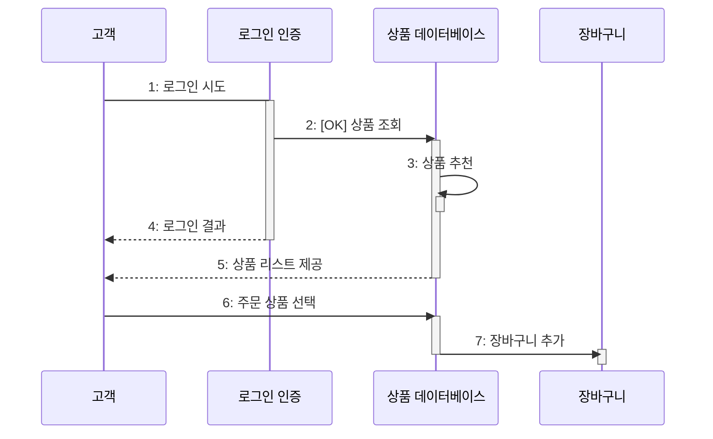

FE News에 소개된 [Include diagrams in your Markdown files with Mermaid](https://github.blog/2022-02-14-include-diagrams-markdown-files-mermaid/) 글을 읽고  
Github에서 다이어그램을 그릴 수 있는 [mermaid.js](https://mermaid-js.github.io/mermaid)의 몇 가지 다이어그램을 따라 그려봄

## sequence 다이어그램

특정 행동이 어떤 순서로 어떤 객체와 어떻게 상호작용 하는지 표현하는 행위 다이어그램



```
sequenceDiagram
  participant Alice
  participant Bob
  
  Alice->>John: Hello John, how are you?
  loop Helathcheck
    John->>John: Fight against hypochondria
  end
  
  Note right of John: Rational thoughts <br/>prevail...
  
  John-->>Alice: Great!
  John->>Bob: How about you?
  Bob-->>John: Jolly good!
```

- `->>` : 실선, `-->>` : 점선 (화살표를 표시하지 않으려면 `>` 하나만 사용)  
  \+ `-)`는 async, `-x`는 x 표시
- `loop ... end` : 반복문
- `participant [name]` : 객체 (명시하지 않은 `John`도 객체로 구분됨)

### 연습




박스의 시작 - activate, 박스의 끝 - deactivate
